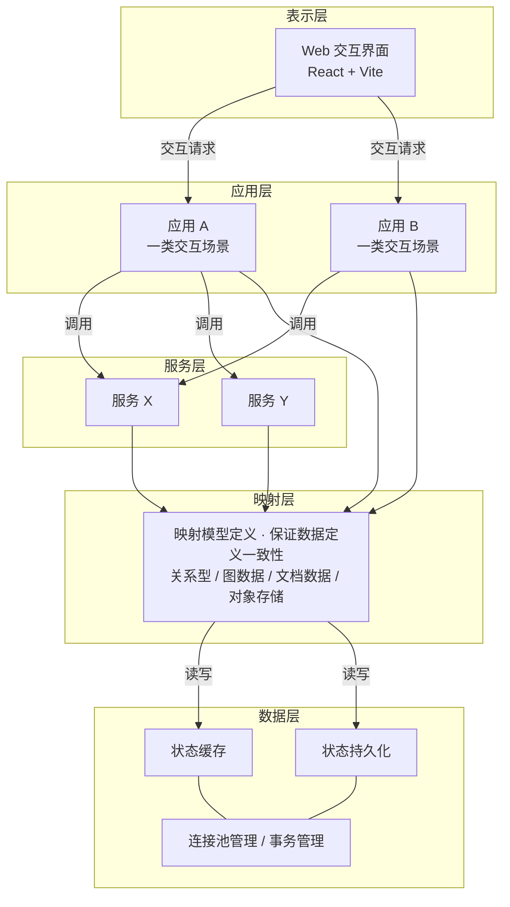

# FlowFactory - An Agent Workflow Production Factory

## introduction

FlowFactory 是一个 **Agent 工作流生产工厂**：把 LangGraph 驱动的 Agent 工作流，从交互、编排、知识检索到持久化与观测，做成可上线、可恢复、可扩展的生产系统，而不是单次脚本或 Demo。

**功能目标**

- 提供 Web 管理台与会话界面，支持 Agent 流式输出、结构化结果展示，以及工作流相关后台操作。
- 按交互场景拆分**应用**，每个应用对应一类用户场景；底层**服务**可被多个应用复用，应用也可组合多个服务。
- 以 LangGraph 为核心运行 Agent 图：支持 checkpoint、中断、人在回路（HITL），长时 run 异步执行，失败可重试、状态可恢复。
- 内置知识检索链路：原文存对象存储，初期在 Postgres 上做向量 + 全文混合召回与重排；按需扩展 ES/Milvus 与领域图库。
- 提供鉴权、限流、可选内容护栏，以及 OpenTelemetry + LangFuse 全链路可观测，便于排障与成本核算。

## Structure
### abstract
工程总体可以分为以下几个部分，每个部分承担的职责和功能描述如下:

- **表示层**: 直接与人类进行交互的图形化前端界面；负责提供友好的交互界面和基于 Agent 产出内容构建的丰富响应结果展示
- **应用层**: 为表示层交互提供功能支持, 应用根据发生在前端界面中的各类交互场景归纳得到；一个应用通常只负责为某一类交互场景提供功能支持
- **服务层**: 为应用层的应用提供功能实现所必要的一切基础设施；负责支持应用层的功能逻辑正常运转，服务通常可以为多个应用提供基础设施保障，一个应用可能同时享受多个服务提供的功能支持
- **映射层**: 提供各个 应用/服务 在运转过程中所定义的数据结构与数据层存储的关系型数据/图数据/文档数据/对象存储数据之间存在的映射模型定义, 负责保证数据定义的一致性
- **数据层**: 为各个 应用/服务 的运转过程提供状态缓存/状态持久化支持；负责数据库连接池管理、数据操作事务管理

工程结构如下图所示:

### technic selection table

工程各层所涉及的技术路线/组件选型见下表。**必选**为必要的组件；**按需**计划在出现明确约束或瓶颈的后续工程阶段再引入。

| 事项 | 选型结果 | 理由 |
| --- | --- | --- |
| 表示层技术栈主体 **必选** | React + Vite | SPA 将表示层与应用层分离；组件生态适合流式结果与复杂交互；Vite 只负责开发与构建 |
| 表示层 UI **必选** | Antd + Ant Design X（会话区） | Antd 管后台表单/表格/布局；会话区用 Ant Design X 或 `react-markdown` + Shiki 自研，对接自建 SSE 协议。不引入 Vercel AI SDK（偏 Next 数据流，与 FastAPI SSE 需额外适配） |
| 表示层与应用层交互 **必选** | 流式用 SSE，普通操作用 RESTful | Agent 下行是单向吐 token，SSE 走标准 HTTP、实现简单、易过网关；上行命令仍走 REST。WebSocket 的全双工在此用不上 |
| 应用层框架 **必选** | FastAPI | 与 LangGraph 同语言；async 适合等待 LLM；与 Pydantic 原生集成。持久化用 SQLAlchemy，不把 SQLModel 当作必选封装 |
| 鉴权 **必选** | JWT + Redis 记 `jti` | 网关可本地验签；登出、踢人、改密时用 Redis 黑名单作废未过期 token（TTL = 剩余有效期）。短 JWT + 刷新令牌 |
| 内容安全护栏 **按需** | LangGraph 节点钩子 + 独立策略服务 | 越狱/注入检测放在图入口节点；PII/敏感词过滤放在输出节点（SSE 流式场景中间件难以截断 token）。目标是降低风险，不承诺「绝对安全」。重型检测不占 FastAPI 入口 worker |
| 工作流执行 **必选** | Celery（prefork）+ RabbitMQ | FastAPI 只接短请求与 SSE；长 LangGraph run 进队列。Celery 负责任务提交、重试、定时与并发上限；prefork 隔离崩溃。LangGraph 的 checkpoint、中断、HITL 由 Postgres checkpointer 承担，不由 Celery 替代 |
| 工作流外层编排 **按需** | Temporal | 仅当出现跨天等待、图外系统补偿（支付/工单）、需信号唤醒的长 saga 时，用 Temporal 作**外层**编排（Activity 内跑 LangGraph），避免与图内 checkpoint 形成双状态机 |
| 缓存与热状态 **必选** | Redis | 限流、会话缓存、JWT `jti` 黑名单 |
| 对象存储 **必选** | MinIO | 对齐映射层的文件 / 产物对象存储；S3 协议，便于自建，上云可换官方 S3 |
| Agent 技术栈 **必选** | LangGraph 为主；LangChain 按需 | LangGraph 提供可恢复工作流（checkpoint、中断、人机协同）；LangChain 提供模型与工具适配。容错靠 Postgres checkpoint + Celery 重试；并发靠 RabbitMQ 队列深度与 worker 数 |
| 知识检索 **必选（初期）** | Postgres：`pgvector` + `tsvector`（`zhparser`） | 初期不拆 ES/Milvus：向量用 pgvector，词面全文用 tsvector + 中文分词（`pg_trgm` 只做模糊匹配，不能替代全文）。原文在 MinIO，chunk id 与索引对齐。应用层 RRF 融合两路召回 |
| 重排模型 **必选** | ONNX Runtime（跑在 Celery worker） | 交叉编码器重排提高 top-k 质量；放在图/检索 worker 进程，不占 FastAPI 事件循环 |
| 知识检索扩展 **按需** | Elasticsearch + Milvus | 词面召回或过滤聚合明显弱于 PG、或向量规模/ QPS 出现瓶颈时再拆。Milvus 与 Nebula 升级条件独立（向量规模 vs 图建模需求） |
| 主存储与 checkpoint **必选** | Postgres | 事务与数据层一致；JSONB 覆盖部分文档数据；LangGraph checkpoint 落在 Postgres，保证在途图可恢复 |
| 图数据存储 **按需** | Nebula / Postgres AGE | 只承载领域图（知识、血缘、多跳关系），不跑 LangGraph 工作流。信创/国产化选 Nebula；无约束且规模中小优先 AGE，少一套运维面 |
| 全链路可观测性 **必选** | OpenTelemetry + LangFuse | OTel 采集 HTTP/DB/队列/Temporal 链路；LangFuse 记录 prompt、token、工具调用与失败原因。Prompt 入库前脱敏，避免观测面本身泄漏 PII |

## How to Start
### Deploy
#### by source code
#### by container