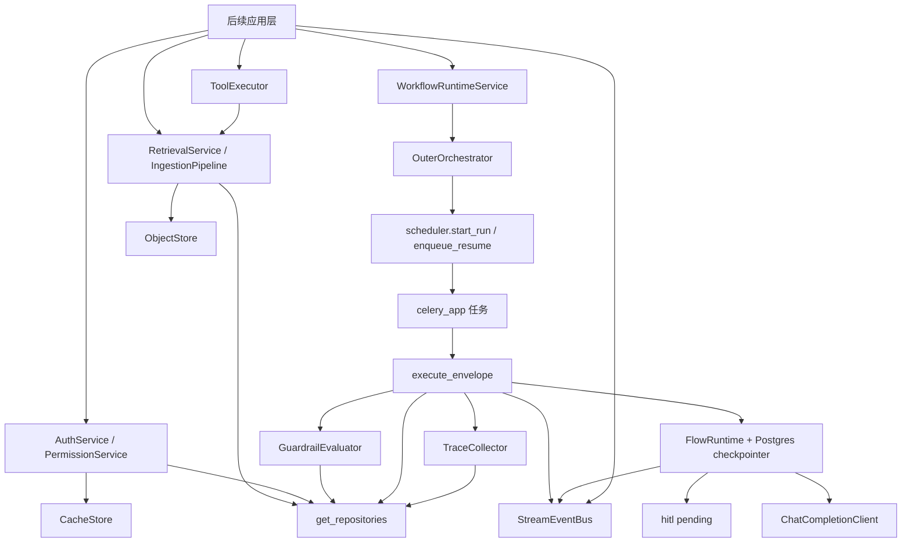
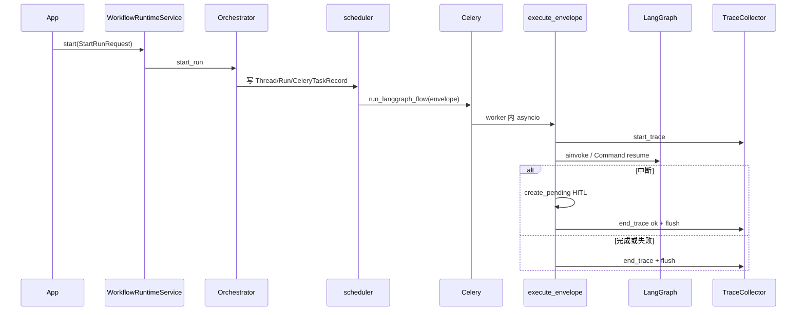
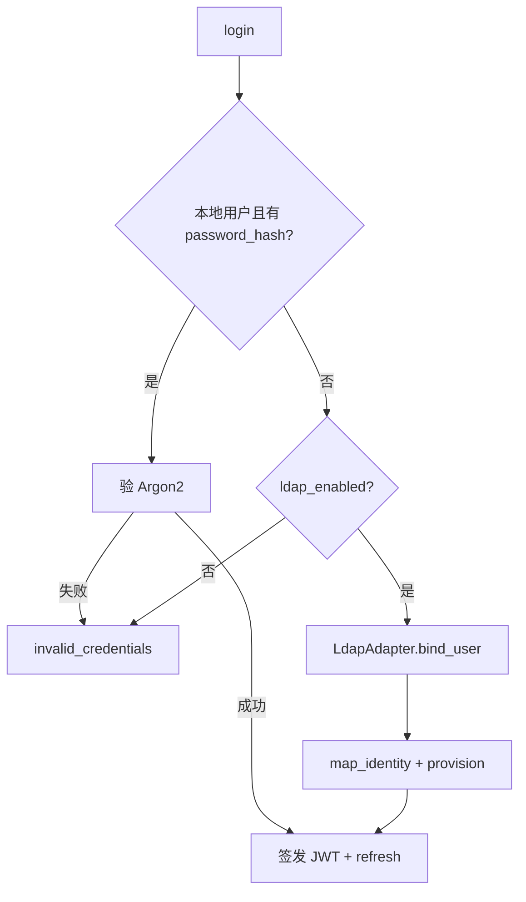
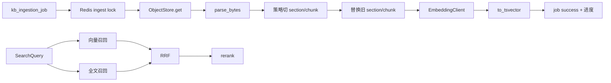
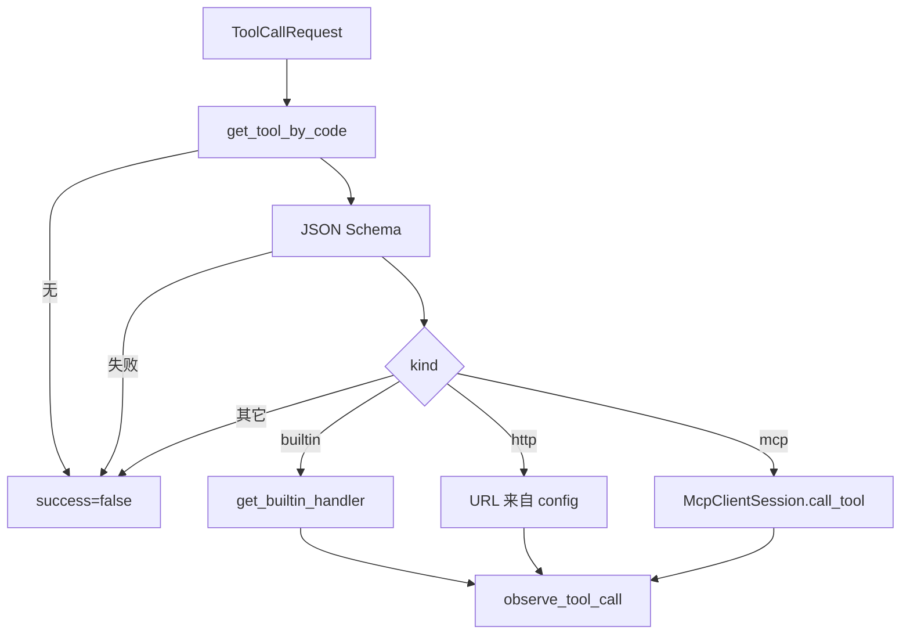
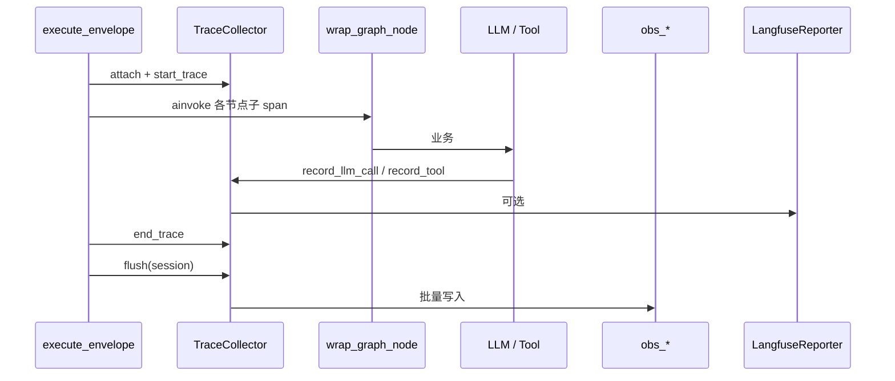
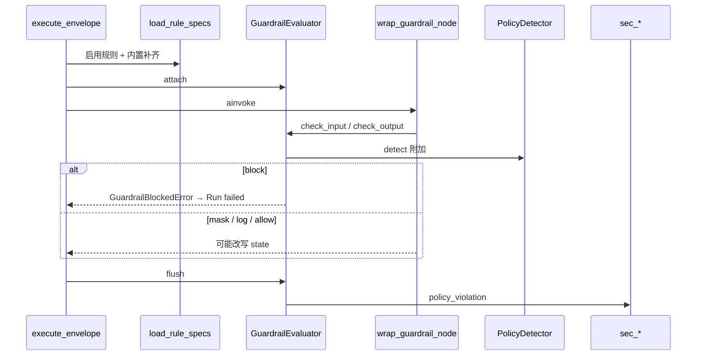

# 服务层说明

本文档整理 `src/backend/service/` 现状：各服务如何使用、原理、工作与协作流程，以及如何按现有模式扩展。表结构、列级字段与仓储方法以 [data_schema_server.md](./data_schema_server.md) 为准，此处不重复展开。

应用层 FastAPI / SSE 已接入 `get_stream_bus()`。环境变量前缀为 `FLOWFACTORY_`。

## 1. 概述

工程把「可被多个应用复用的运行时能力」放在服务层。包物理位置都在 `src/backend/service/`，施工状态上再分为：

| 分类 | 包 | 说明 |
| --- | --- | --- |
| 数据层支撑 | `database` / `persistence` / `cache` | 连接池、仓储、Redis 热状态；业务服务禁止绕过仓储直接拼 SQL |
| 业务服务 | `runtime` / `celery_app` / `orchestration` / `auth` / `knowledge` / `storage` / `tools` / `observability` / `guardrail` / `events` | 工作流、调度、鉴权、检索、对象、工具、观测、护栏、流式总线 |

配置集中在 `settings.config.Settings`。测试与 worker fork 后调用 `reset_settings()` 清缓存。

## 2. 服务一览

| 包 | 应用侧入口 | 主要依赖 | 配置前缀（字段名） |
| --- | --- | --- | --- |
| `service.database` | `session_scope` / `get_db_session` | SQLAlchemy async + psycopg | `pg_*` / `db_*` |
| `service.persistence` | `get_repositories(session)` | ORM 映射层 | — |
| `service.cache` | 各 `*CacheStore` | Redis | `redis_*` |
| `service.runtime` | `WorkflowRuntimeService` | 编排、Celery、checkpointer、LLM、观测 | `llm_*` / `hitl_*` / `beat_*` / `planner_max_steps` / `checkpoint_pool_size` |
| `service.celery_app` | `celery_app` 与任务函数 | runtime / knowledge / auth | `celery_*` / `rabbitmq_url` |
| `service.orchestration` | `get_orchestrator()` | runtime.scheduler | `temporal_*` |
| `service.auth` | `AuthService` / `PermissionService` | persistence.permission、JwtCacheStore、LDAP 工厂 | `jwt_*` / `ldap_*` |
| `service.knowledge` | `IngestionPipeline` / `RetrievalService` | storage、embedding、persistence.knowledge | `embedding_*` / `kb_*` |
| `service.storage` | `get_object_store()` | MinIO / HTTP GET | `minio_*` |
| `service.tools` | `ToolExecutor` / `SkillRuntime` | agent 仓储、knowledge、MCP/HTTP | `tool_http_*` |
| `service.observability` | `TraceCollector` | `obs_*` 仓储、LangFuse 工厂 | `otel_*` / `langfuse_*` / `obs_redact_*` |
| `service.guardrail` | `GuardrailEvaluator` | security 仓储、PolicyDetector | `guardrail_*` |
| `service.events` | `get_stream_bus()` | aio-pika / Fake | `stream_*` / `rabbitmq_url` |

尚未作为独立服务包落地（仓储已有、服务层未封装）：领域图运行时、限流策略服务、审计写入门面、通知投递。需要时在对应仓储上按第 13 章约定新增包，不要塞进 `runtime`。

## 3. 跨服务协作总览



长任务一律进 Celery（图 run / HITL 过期 / Beat / 知识入库 / LDAP 同步骨架）。FastAPI 只接短请求与 SSE。流式帧走 RabbitMQ `ff.stream`，不走 Redis。

## 4. 支撑设施

### 4.1 database

**使用说明**

```python
from service.database.session import session_scope
from service.persistence.factory import get_repositories

async with session_scope() as session:
    repos = get_repositories(session)
    user = await repos.permission.user.get(user_id)
# 正常结束 commit；异常 rollback
```

- Worker / 脚本：`session_scope()`。
- 未来 FastAPI：`get_db_session` 作请求级依赖。
- 引擎：`get_async_engine()`，**线程局部**，适配 Celery prefork；fork 后 `dispose_engines()`。
- Checkpointer 使用同步 DSN（`postgres_dsn`），与业务 AsyncSession 同库不同连接。

**原理**

连接池默认 `db_pool_size=20`、`max_overflow=0`、`pool_pre_ping=True`。一个 `AsyncSession` 绑定一次请求或一次 Celery 任务内的逻辑事务。仓储不管理引擎生命周期。

**工作流程**

1. 当前线程首次取引擎并创建 `async_sessionmaker`。
2. 打开 Session → 业务读写 → commit/rollback → close。
3. prefork 子进程 `worker_process_init` 中 dispose 再惰性重建。

**扩展**

- 不要为单个服务再建一套引擎。需要只读副本时在 Settings 增加 URL，仍走 `create_async_engine` + 线程局部。
- 同步迁移继续用 Alembic + `sync_database_url`。

### 4.2 persistence

**使用说明**

`get_repositories(session)` 返回 `Repositories` 数据类，字段与域一一对应：`permission` / `conversation` / `workflow` / `agent` / `knowledge` / `audit` / `graph` / `security` / `observability` / `notification`。

**原理**

仓储是映射层 ORM 的唯一业务入口。服务层持 `AsyncSession`，通过工厂取仓储，不在服务内散落 `session.execute`（`worker_loop` 中少量任务记录查询除外，后续应收敛）。

**协作**

几乎所有业务服务在持有 Session 后立刻 `get_repositories`。跨域写（例如 HITL 改 Run + 写 pending）必须在**同一 Session / 同一事务**完成。

**扩展**

1. 在 `data_schema` 增加 ORM / 迁移。
2. 在对应 `service/persistence/<域>.py` 增加方法。
3. 若新域：新建仓储类并挂到 `Repositories`。
4. 服务层只调仓储，不直接操作表。

### 4.3 cache

**使用说明**

```python
from service.cache.client import get_redis_client
from service.cache.stores import JwtCacheStore
from service.cache.keys import CacheKeys

store = JwtCacheStore(get_redis_client())
store.blacklist_jti(jti, ttl_seconds)
```

`CacheKeys` 是唯一 key 拼装处。已有 Store：`JwtCacheStore`、`GrantCacheStore`、`RateLimitCacheStore`、`QuotaCacheStore`、`AgentCacheStore`、`KnowledgeCacheStore`、`ConversationCacheStore`、`NotificationCacheStore`、`WorkflowCacheStore`。

测试：`reset_redis_client()` 清除 `get_redis_client` 的 lru 缓存。当前无独立 Redis override 工厂；单测可对 `get_redis_client` 打补丁，或连开发用 Redis。

**原理**

Redis 只承载热状态与短 TTL：JWT 黑名单、授权缓存、Beat/入库锁、Run 活跃标记、**断线文本缓冲**、SSE **在场**集合。权威状态在 Postgres。**禁止**用 Redis Pub/Sub、List 或 Stream 投递 SSE 帧。

**协作**

| 调用方 | Store / key |
| --- | --- |
| Auth | `auth:jwt:*` |
| Permission | `auth:role_grants:{role_id}` |
| Beat | `agent:beat:lock:{id}` |
| 入库 | `kb:ingest:lock` / `progress` |
| Run worker | `wf:run:active` / `wf:hitl:notify` |
| 会话 | `conv:stream:{message_id}` 缓冲；`conv:sse:subscribers` 仅 connection id |

**扩展**

新 key 先加 `CacheKeys` 静态方法，再在对应 Store 封装 get/set/lock。禁止在业务代码里手写 `f"auth:{...}"`。

### 4.4 流式事件总线（`service.events`）

**使用说明**

```python
from service.events.factory import get_stream_bus, set_stream_bus_override
from service.events.schemas import speaking_event

await get_stream_bus().publish(conversation_id, speaking_event(delta="你", message_id=mid))
```

测试注入 `FakeStreamEventBus`：`set_stream_bus_override`。无 `FLOWFACTORY_RABBITMQ_URL` 时工厂返回 Fake。

**原理**

- Celery 任务队列（`wf.*` / `kb.*`）与流式 topic exchange `ff.stream` **隔离**；流式使用**独立 AMQP 连接**。
- 流式背压保守：小 prefetch、帧非持久、本地 `asyncio.Queue` 满则丢帧；publish 失败不导致 Run 失败。优先保护任务提交通道。
- 应用层 SSE 只 `await Queue.get()`，不在生成器里阻塞 AMQP。

**工作流程**

worker llm 节点 `stream` → publish `speaking`（不经护栏）→ 节点返回完整文本 → `wrap_guardrail_node` 对持久化 state 做出口检查 → checkpoint。uvicorn bind `conv.{id}` → put Queue → 状态机 → HTTP SSE。

**扩展**

新事件名加在 `StreamEvent.event` 与应用层状态机；不要把帧写进 Celery 任务体或 Redis。

---

## 5. 工作流运行时（`service.runtime`）

### 5.1 使用说明

应用侧门面：

```python
from service.runtime.service import WorkflowRuntimeService
from service.runtime.schemas import StartRunRequest, RunStatePayload, HitlResumeInput

svc = WorkflowRuntimeService()
run_id = await svc.start(StartRunRequest(
    user_id=user_id,
    flow_id=flow_id,
    input_payload=RunStatePayload(messages=[{"role": "user", "content": "你好"}]),
))
# HITL 恢复
await svc.resume(HitlResumeInput(hitl_id=hitl_id, decision="approve", user_input="同意"))
await svc.cancel(run_id)
```

`StartRunRequest.definition` 可内联 `FlowDefinitionDocument`；为空则从 `agent_flow.definition` 读取。规划 Run 设 `kind=planner` 与 `profile_id`（`flow_id` 列写入 profile_id，无 Flow FK）。图状态**锁定三槽**：`messages`（append）/ `variables`（merge）/ `metadata`（merge）；不开放自定义顶层通道。业务字段只进 `variables`。`schema_version=1` 的图定义见 [data_schema_server.md](./data_schema_server.md)；现网松散 dict 为 version `0`。

已实现节点：v0 `kind`（`passthrough` / `interrupt` / `llm`）；v1 `NodeType`（`start` / `end` / `llm` / `tool` / `assign` / `hitl` / `subgraph` / `custom=passthrough`）。v0 未知 kind **按 passthrough 处理并打 warning**。v1 未知 `custom.handler_key` 编译失败。规划循环是独立固定图 `PlannerRuntime`（planner ⇄ tools），**不是**一种 Flow 节点。

LLM：`get_chat_client()` → `OpenAICompatClient`（vLLM OpenAI 兼容）。按库配置解析走 `resolve_llm_client(llm_id=...|code=...)`。规划步用 `complete_turn(..., tools=)`。测试用 `set_chat_client_override(FakeChatCompletionClient())`（见 `runtime/llm.py`），override 优先于库配置。`planner_max_steps` 限制循环。

Checkpointer：`get_checkpointer()`，进程内 setup Postgres 表。

`SkillRuntime`（`service/tools/skill.py`）按 Profile.`skill_ids` 拼技能说明、展开工具，执行走 `ToolExecutor`。

### 5.2 原理

- **调度单位**是 `Run` + `Thread` 快照（Postgres），不是 Celery 任务 ID。
- **图状态**由 LangGraph + Postgres checkpointer 负责；Celery 只投递「执行/恢复」信封 `CeleryTaskEnvelope`。
- **HITL**：图内 `interrupt()` 或 `interrupt_before` 导致当次 `ainvoke` 停住；服务层写 `wf_hitl_pending`，Run 置 `interrupted`。恢复走 `Command(resume=...)` 再入队。
- **子图**：禁止同进程嵌套 compile。子 Flow 使用独立三槽 State 与独立 `langgraph_thread_id`，作为新 Celery Run；父留 checkpoint，snapshot 置 `waiting_child` 后释放 worker。子完成/失败或超时/取消后，将 `SubgraphNodeResult` 写入父三槽再 resume 父。超时或取消**只取消子**，父不自动取消。取消父则级联取消未完成子且不再 resume。表 `wf_child_run_pending` 已落地。
- **规划循环**：`execute_envelope` 读 `kind=planner` 时 `PlannerRuntime.compile_for_profile`，同一 `run_langgraph_flow` 任务。完成时按 `assistant_message_id` 回写会话消息。
- **Beat**：业务 cron 以 `agent_beat_task` 为准；Celery Beat 只跑固定 tick（`dispatch_beat_tasks`、`expire_hitl_pending`、`expire_child_run_pending`）。规划 Beat 仍见 unreached。

Run 状态：`pending` / `running` / `interrupted` / `waiting_child` / `completed` / `failed` / `cancelled`。

### 5.3 工作 / 协作流程



Beat：`dispatch_due_tasks` 读启用任务 → `croniter` 判断窗口 → `AgentCacheStore.acquire_beat_lock` → 以 `beat_system_user_id` 调 `start_run`。未配置该用户则跳过并打错误日志。

### 5.4 扩展指南

| 目标 | 做法 |
| --- | --- |
| 新节点 kind | 在 `flow.py` 增加编译分支；用 `wrap_graph_node` 包一层；更新常量 `NODE_*`；补单测。不要把重逻辑写进 Celery task。 |
| 规划循环 / 工具节点 | 规划走 `PlannerRuntime` + `SkillRuntime`（自研循环，不引入 deepagents）。v1 Flow `tool` 节点仍调 `ToolExecutor`。 |
| 子图节点 | **不要**把子 Flow 编进同一张 `StateGraph`。独立 Run + `waiting_child` + `wf_child_run_pending`；超时/取消回传 `SubgraphNodeResult`。
| 换 LLM 供应商 | 实现 `ChatCompletionClient.complete`，`set_chat_client_override` 或改 `get_chat_client` / `resolve_llm_client`。usage 通过 `observe_chat_completion` 交给 Collector。模型目录写接口在应用 `models`。 |
| 新 HITL 决策 | 扩展 `HitlResumeInput.decision` 需同步改 `hitl.apply_resume_decision` 与 Run 状态机。 |

---

## 6. Celery 调度（`service.celery_app`）

### 6.1 使用说明

```python
from service.celery_app.app import celery_app
from service.celery_app.dispatch import send_workflow_task
```

业务代码优先走 `scheduler` / `IngestionPipeline` 入队，不要直接散落 `delay()`。

| 任务名常量 | 函数 | 队列配置 |
| --- | --- | --- |
| `TASK_RUN` | `run_langgraph_flow` | `celery_queue_run`（默认 `wf.run`） |
| `TASK_RESUME` | `resume_langgraph_flow` | 同上 |
| `TASK_BEAT` | `dispatch_beat_tasks` | `celery_queue_beat` |
| `TASK_EXPIRE_HITL` | `expire_hitl_pending` | 同上 |
| `TASK_INGEST` | `ingest_knowledge_doc` | `celery_queue_ingest`（`kb.ingest`） |
| `TASK_LDAP_SYNC` | `sync_ldap_directory` | beat 队列；`ldap_sync_beat_enabled` 才进 Beat |

默认 `celery_eager=true`、`rabbitmq_url` 空则 `memory://`。生产填 RabbitMQ 并关 eager。

### 6.2 原理

FastAPI 不跑长 LangGraph。prefork 隔离崩溃；`task_acks_late` + `task_reject_on_worker_lost` 降低丢任务窗口。图内可恢复性靠 checkpoint，不靠 Celery 重放业务状态。

任务函数内用 `run_coro_factory` 包异步 `session_scope`，因为 Celery worker 是同步入口。

### 6.3 工作 / 协作流程

`worker_process_init`：`reset_settings` → `reset_redis_client` → `reset_observability_context` → `dispose_engines` → `reset_checkpointer`。

prerun/postrun 信号更新 `wf_celery_task_record`（见 `signals.py` 与任务模块）。

### 6.4 扩展指南

新增长任务检查清单：

1. `runtime/constants.py` 增加 `TASK_*`。
2. `tasks.py` 注册 `@celery_app.task`，内部 `session_scope` + `run_coro_factory`。
3. `app.py` 的 `task_routes` 指定队列。
4. 需要定时则写入 `beat_schedule`。
5. 单测在 eager 下直接调任务函数。

禁止在 FastAPI 请求协程里跑入库或整图 `ainvoke`。

---

## 7. 外层编排（`service.orchestration`）

### 7.1 使用说明

```python
from service.orchestration.factory import get_orchestrator

orch = get_orchestrator()
run_id = await orch.start_run(request)
```

`temporal_enabled=false`（默认）→ `PassthroughOrchestrator`（直连 `scheduler`）。为 true → `TemporalOrchestrator` 骨架，**不要求** Temporal 服务在单元测试中可达。

协议：`OuterOrchestrator.start_run` / `resume_run` / `cancel_run` / `signal_hitl`。

### 7.2 原理

外层编排只处理**图外** saga（跨天等待、工单、补偿）。**禁止**把 LangGraph 节点拆成 Temporal Activity，**禁止** Temporal 写 checkpoint。Activity 若落地，只应调用服务层 `Run`/`scheduler`。

### 7.3 工作 / 协作流程

默认路径：`WorkflowRuntimeService` → `PassthroughOrchestrator` → `start_run` / `enqueue_resume` / `cancel_run`。

HITL 信号：`signal_hitl` 在 Passthrough 中与 resume 路径对齐（见 `passthrough.py`）。

### 7.4 扩展指南

1. 实现 `OuterOrchestrator`。
2. 工厂按配置切换，默认保持 Passthrough。
3. 集成测试只断言「未写 checkpoint 表以外的 Temporal 状态」；图状态仍以 LangGraph 为准。
4. 未出现跨天补偿需求前，不要把 Passthrough 逻辑迁进 Temporal。

---

## 8. 用户鉴权（`service.auth`）

### 8.1 使用说明

```python
from service.auth.service import AuthService
from service.auth.permission import PermissionService
from service.auth.schemas import LoginCredentials, PermissionCheckRequest

auth = AuthService(session)
pair = await auth.login(LoginCredentials(username="alice", password="..."))
claims = await auth.verify_access_token(pair.access_token)
await auth.logout(...)          # access jti 进 Redis 黑名单
await auth.revoke_all_sessions(user_id)  # 踢人 / 改密

perm = PermissionService(session)
result = await perm.check(PermissionCheckRequest(
    user_id=claims.sub, asset_type="flow", asset_key="...", action="execute",
))
```

失败抛 `AuthError`（含 `code`），应用层应映射为 HTTP 401/403，不要把内部细节返回客户端。

LDAP：`ldap_enabled=false` 时登录不访问目录。测试：`set_ldap_adapter_override(FakeLdapAdapter(...))` 并打开 `ldap_enabled`。

### 8.2 原理

- 本地用户有 `password_hash`：**只验 Argon2id**，失败不回落到 LDAP。
- 否则且 LDAP 开启：`bind_user` → `map_identity` → `provision_ldap_user` 写 `sys_user` + `sys_external_identity`（无本地密码）。
- Access：短 JWT（HS256），`jti` 可黑名单；`revoke_before` 作废该时刻之前签发的 access。
- Refresh：opaque，库内只存 hash；同 `family_id` 轮换；已吊销的 refresh 再使用会吊销整族（重用检测）。
- 授权：角色 grants 并集；`is_superuser` 直通；`admin` action 覆盖同资产其它动作。Grants 可走 Redis，TTL 300s。

适配器**不依赖 ORM**。

### 8.3 工作 / 协作流程



`sync_ldap_directory` 写 `sys_ldap_sync_job` 并调 `execute_user_sync`；默认不进 Beat。

### 8.4 扩展指南

| 目标 | 做法 |
| --- | --- |
| 真实 LDAP | 配齐 `ldap_*`，`ldap_enabled=true`；完善 `Ldap3Adapter`，不改登录顺序。 |
| 新目录协议 | 实现 `LdapAdapter`，工厂返回新类型。 |
| 新资产类型 | 数据在 Permission 域；`PermissionService.check` 已按 `asset_type`+`asset_key`+`action` 通用匹配。 |
| 应用层鉴权依赖 | 校验 access → `verify_access_token` → `PermissionService.check`。 |

---

## 9. 知识检索（`service.knowledge`）

### 9.1 使用说明

入库（通常由 Celery `ingest_knowledge_doc` 调用）：

```python
from service.knowledge.ingestion import IngestionPipeline
from service.knowledge.schemas import IngestDocumentRequest, ChunkerOptions

pipe = IngestionPipeline(session, IngestDocumentRequest(
    job_id=job_id, doc_id=doc_id,
    chunker=ChunkerOptions(strategy="markdown"),  # 可选，覆盖全局
))
stats = await pipe.run()
```

检索：

```python
from service.knowledge.retrieval import RetrievalService
from service.knowledge.schemas import SearchQuery

hits = await RetrievalService(session).search(SearchQuery(
    collection_ids=[collection_id],
    query_text="如何配置 JWT",
    top_k=20,
    filters={"doc_id": str(doc_id)},  # 可选；其余键走 JSONB @>
))
```

测试：`set_embedding_client_override(FakeEmbeddingClient())`、`set_reranker_override(FakeReranker())`、`set_object_store_override(MemoryObjectStore())`。

切片策略名：`recursive`（默认）、`markdown`、`fixed`、`page`。未知名 `UnknownChunkStrategyError`，job 失败。

原文：UTF-8 文本 / Markdown / PDF（`pypdf` 按页）。向量维度必须等于 `embedding_dim`（当前 1024，bge-m3）。

### 9.2 原理

- chunk id 对齐向量列、`content_tsv`、对象存储中的原文引用。
- 双路召回（pgvector + `to_tsvector`，配置 `kb_fts_config` 默认 `simple`，本轮未装 zhparser）→ RRF（`kb_rrf_k`）→ 可选 ONNX 交叉编码。`kb_rerank_onnx_path` 空则为 `IdentityReranker`。
- 同一 `doc_id` Redis 锁阻止并发双写入库。
- 重排加载失败回退 Identity 并打错误日志。

### 9.3 工作 / 协作流程



内置工具 `kb_retrieve` 直接调用 `RetrievalService.search`。

### 9.4 扩展指南

| 目标 | 做法 |
| --- | --- |
| 新切片策略 | 实现 `(text, size, overlap) -> ChunkParseResult`，写入 `chunker.py` 的 `KNOWN_STRATEGIES` 与 `_PARSERS`（当前无独立 register API）。 |
| 新原文格式 | 扩展 `parser.parse_bytes` MIME/魔数分支，最终仍产出文本再切。 |
| 换 embedding | 实现 `EmbeddingClient.embed`，注意维度与 `kb_chunk.embedding` 一致（可能要迁移）。 |
| 换重排 | 实现 `Reranker` 协议，工厂在路径非空时加载；测试用 Fake。 |
| zhparser | 改 `kb_fts_config` 并在 Postgres 装扩展；检索 SQL 已参数化 config。 |

---

## 10. 对象存储（`service.storage`）

### 10.1 使用说明

```python
from service.storage.factory import get_object_store, set_object_store_override
from service.storage.memory import MemoryObjectStore

store = get_object_store()
stat = store.put("flowfactory", "kb/raw/xxx.pdf", data, content_type="application/pdf")
raw = store.get("flowfactory", "kb/raw/xxx.pdf")
meta = store.stat("flowfactory", "kb/raw/xxx.pdf")
```

协议：`put` / `get` / `stat`。默认 `MinioObjectStore`；`minio_public=true` 时 GET 可走匿名 HTTP。测试注入 `MemoryObjectStore`。

### 10.2 原理

原文与产物的字节在对象存储；Postgres 只存 `file_storage_object` 元数据（bucket、key、etag、大小）。S3 协议便于以后换官方 S3。

### 10.3 协作

`IngestionPipeline.fetch_raw` 用文档上的 `storage_object_id` 取元数据再 `store.get`。其它域（会话附件、审计导出）应复用同一工厂，不要新建 MinIO 客户端。

### 10.4 扩展指南

实现 `ObjectStore` 三方法 → `set_object_store_override` 或改 `get_object_store`。保持 **同步** 接口（当前协议为同步；Celery prefork 中调用）。若改为异步，需同时改入库流水线。

---

## 11. 工具分发（`service.tools`）

### 11.1 使用说明

```python
from service.tools import ToolExecutor, ToolCallRequest, register_builtin

executor = ToolExecutor(session)
result = await executor.execute(ToolCallRequest(
    tool_call_id="c1",
    tool_code="kb_retrieve",
    arguments={"query_text": "...", "collection_ids": [str(cid)]},
))
# result.success 为 False 时读 result.error；不要当异常冒泡给规划层
```

`session` 构造期不能为空。按 `agent_tool.code` 查库，用 `agent_tool.schema` 做 JSON Schema 校验。

kind：

- `builtin`：注册表 handler，现仅 `kb_retrieve`。
- `http`：`config` 提供 `method` / `url` / `headers` / `param_in`（`body`|`query`）。**arguments 不能覆盖 url**。
- `mcp`：`get_mcp_session(server)`；生产缺配置时 `execute` 返回失败，不在 import 期崩溃。

HTTP 测试：`set_http_transport_override` 或给 `HttpxToolTransport` 注入 `httpx.MockTransport`。MCP：`set_mcp_session_override(FakeMcpClientSession())`。

### 11.2 原理

ToolExecutor 按 `agent_tool.kind` 分发。规划循环经 `SkillRuntime` 调用它；v1 Flow `tool` 节点同样调用。业务失败与未知 kind 返回 `ToolCallResult(success=false)`。有活跃 `TraceCollector` 时 `observe_tool_call` 写工具缓冲（摘要脱敏）。

### 11.3 工作 / 协作流程



`kb_retrieve` → `RetrievalService`；MCP 配置来自 `agent_mcp_server`。

### 11.4 扩展指南

| 目标 | 做法 |
| --- | --- |
| 新内置工具 | `async def handler(session, arguments) -> object`，`register_builtin("code", handler)`；库中 `agent_tool.kind=builtin` 且 code 一致；补 schema。 |
| 新 HTTP 工具 | 只加库配置，不必改 Python；严禁把 URL 放进模型 arguments。 |
| 真实 MCP | 配 `agent_mcp_server`，完善 `SdkMcpClientSession`；测试保持 Fake。 |
| 新 kind | 在 `ToolExecutor._dispatch` 增加分支；失败仍返回 Result。 |

---

## 12. 全链路可观测（`service.observability`）

### 12.1 使用说明

图执行路径已自动埋点：`execute_envelope` 创建 Collector、`start_trace` / `end_trace` / `flush`；`compile` 对三类节点 `wrap_graph_node`。应用一般不必手写。

手动（例如独立脚本）：

```python
from service.observability import TraceCollector, attach_collector, reset_collector
from service.observability.schemas import TraceContext

c = TraceCollector()
token = attach_collector(c)
try:
    c.start_trace("job", TraceContext(name="manual"))
    with c.record_span("step"):
        ...
    c.end_trace("ok")
    await c.flush(session)
finally:
    reset_collector(token)
```

LangFuse：`langfuse_enabled=false` → `NoOpLangfuseReporter`。测试：`set_langfuse_reporter_override(FakeLangfuseReporter())`。

脱敏：`redact_text` / `hash_content`；内置邮箱、手机、身份证、银行卡粗匹配；`obs_redact_extra_patterns` 逗号分隔额外正则。不承诺无 PII。

`otel_otlp_endpoint` 为空：只本地缓冲 + Postgres flush，无 OTLP 网络。

### 12.2 原理

一次 envelope（一次 `ainvoke`，含 HITL 中断当次）对应一条 root trace，结束即 flush `obs_trace` / `obs_span` / `obs_llm_call` / `obs_tool_invocation` / `obs_prompt_snapshot`。`trace_id`/`span_id` 来自 OpenTelemetry SDK。flush 按 `span_id` UNIQUE 跳过已存在行。

HITL 中断记 `end_trace("ok")`，不把未闭合 span 留到 resume。跨 HITL 的单一超长 span、Celery/SQLAlchemy/Temporal 自动 instrumentation、LangChain Callback **本轮未做**。

LLM usage 在 `ChatCompletionClient.complete` 内交给 Collector；Fake 客户端 tokens=0。Prompt 入库前脱敏，另存 SHA-256。

上报 LangFuse 失败只打 loguru，不打断 run。

### 12.3 工作 / 协作流程



Celery prefork 后 `reset_observability_context()`，避免 ContextVar 串进程。

### 12.4 扩展指南

| 目标 | 做法 |
| --- | --- |
| 新节点埋点 | 编译期继续 `wrap_graph_node`；不要在 worker 里手写 span 名称散落。 |
| 工具自动挂图 | 在未来 tool 节点内调 `ToolExecutor`（已会 `record_tool`）。 |
| 新观测后端 | 实现 `LangfuseReporter` 或增加独立 Reporter 协议；flush 仍以 Postgres 为权威。 |
| 更强脱敏 | 只加正则到配置或 `redact.py`；不要在 SSE 中间件截 token。 |

---

## 13. 内容护栏（`service.guardrail`）

### 13.1 使用说明

```python
from service.guardrail import (
    GuardrailEvaluator,
    GuardrailCheckInput,
    attach_evaluator,
    reset_evaluator,
    load_rule_specs,
)

specs = await load_rule_specs(session)  # 库表 ∪ 内置（可关）
evaluator = GuardrailEvaluator(specs, context={"run_id": run_id, "user_id": user_id})
token = attach_evaluator(evaluator)
try:
    out = await evaluator.check_output(
        GuardrailCheckInput(text=reply, stage="output")
    )
    await evaluator.flush(session)
finally:
    reset_evaluator(token)
```

流式：`consume_chunk` → `finalize_output`。`block` 抛 `GuardrailBlockedError`。图执行路径由 `execute_envelope` 自动加载规则、attach、flush。

测试：`set_policy_detector_override(FakePolicyDetector(...))`。`guardrail_policy_url` 空则 `NoOpPolicyDetector`。

### 13.2 原理

降低风险，不承诺绝对安全。越狱/注入在**入口**；PII/敏感词在**出口**（含未来 SSE 累积，不在 FastAPI 中间件截 token）。评估不访问 ORM；`flush` 才写 `sec_policy_violation`（excerpt 再脱敏）。多规则优先级 **block > mask > log > allow**。`log` 仍放行但记违规。

远程 `PolicyDetector` 为附加命中；URL 空不发网；远程失败只打日志，本地结果仍生效。重型分类模型本轮未做。限流 `RateLimiter` 本轮未做。

### 13.3 工作 / 协作流程



包装顺序：外层观测 span、内层护栏。Celery prefork 后 `reset_guardrail_context()`。

### 13.4 扩展指南

| 目标 | 做法 |
| --- | --- |
| 新规则 | 写入 `sec_guardrail_rule`（`jailbreak` / `pii` / `keyword` + config）。 |
| 新 rule_type | 在 `rules.match_rule` 分支；未知类型跳过并 warning。 |
| 外置策略服务 | 实现 `PolicyDetector` 或配 `guardrail_policy_url`；测试用 Fake。 |
| 关闭 | `guardrail_enabled=false` 包装为空操作。 |

---

## 14. 通用扩展约定

各外部系统接入统一为四件套，缺一不可：

1. **Protocol**：适配器不依赖 ORM / FastAPI。
2. **Fake**：内存实现，单测默认走这条。
3. **SDK 适配**：缺配置不在 **import 期**崩溃，在调用期返回失败或 NoOp。
4. **工厂 + override**：`get_x()` / `set_x_override()`，测试注入，生产按 Settings 选择。

已采用该模式的工厂：

| 能力 | 工厂 |
| --- | --- |
| 对象存储 | `get_object_store` |
| Embedding | `get_embedding_client` |
| Reranker | `get_reranker` |
| LLM | `get_chat_client` |
| LDAP | `get_ldap_adapter` |
| MCP | `get_mcp_session` |
| HTTP 工具传输 | `get_http_transport` |
| LangFuse | `get_langfuse_reporter` |
| 护栏远程策略 | `get_policy_detector` |
| 外层编排 | `get_orchestrator`（无 override，按配置分支） |
| 流式事件 | `get_stream_bus` |

配置：只加 `Settings` 字段 + `FLOWFACTORY_` 环境变量，不在代码里写死集群地址（文档中的默认 IP 仅反映当前开发默认值）。

编码：服务层日志用 **loguru**；错误用 `AuthError` / `HTTPException`（应用层）或返回 Result（工具）；禁止 `print`；禁止 `Any` / 隐式类型。

施工：改服务前查 `docs/construction/status.md`；方案进 `docs/plan`；历史 plan **不可改**。

## 15. 与其它设计文档的关系

| 文档 | 关系 |
| --- | --- |
| [data_schema_server.md](./data_schema_server.md) | 表、Redis key、可运行对象方法签名、Pydantic 字段的权威来源 |
| [api_reference_server.md](./api_reference_server.md) | 未来 HTTP/SSE 契约；服务层尚未全部暴露为 API |
| [change_log.md](./change_log.md) | 设计与实现变更记录 |
| `docs/plan/2026-08-18-*`、`2026-08-19-*` | 各服务落地时的锁定方案与验收标准 |

本文档描述 **2026-08-19 流式 RabbitMQ 总线与 LLM stream 之后** 的代码事实。
