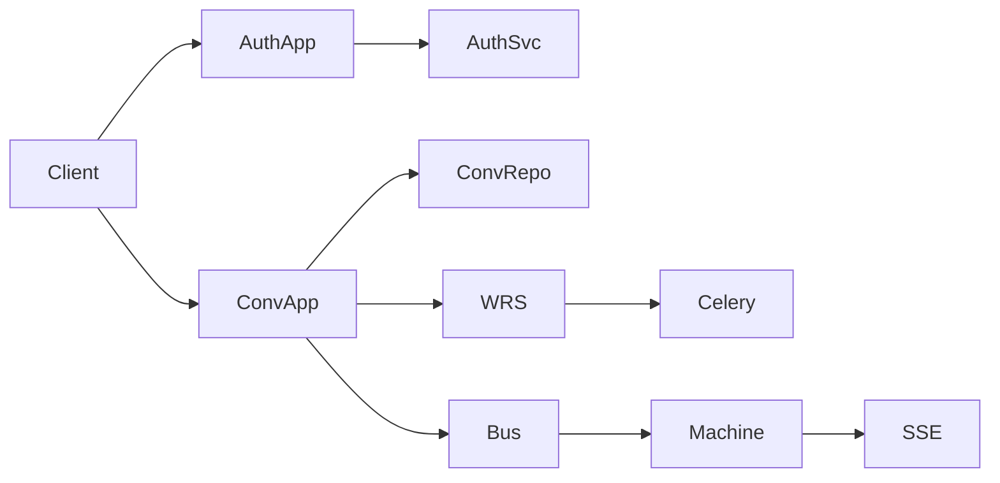

# 2026-08-19 应用层骨架与首批应用 - 应用层 - 修改

## 用户需求理解

服务层（runtime / celery / auth / knowledge / tools / observability / guardrail 等）与映射层、数据层已落地；`src/backend/api/` 尚不存在，`docs/design/api_reference_server.md` 仅有标题。用户要求**启动应用层建设**。

对齐架构约定：

- 应用层用 FastAPI；按交互场景拆分 **Application**，每个 Application 通过 `build_router()` 挂 REST（流式用 SSE）。
- Application / Service **不落绑定表**；启动扫描 `api/apps/`，注册进进程内 `ApplicationRegistry`。
- FastAPI 只接短请求与 SSE；长 LangGraph run 仍走 `WorkflowRuntimeService` → Celery。
- 数据访问走已有 `get_db_session` / `get_repositories`；鉴权走 `AuthService` / `PermissionService`。
- 错误用 `HTTPException` 或统一 StatusCode；日志 `loguru`；禁止 `Any`。

本轮**不建设表示层前端**。

### 澄清过程

1. 用户确认本轮只做：**骨架、鉴权、会话、SSE 流协议状态机**；知识/Flow/HITL 后台等后续轮次。
2. 用户要求先说明「跨进程通道」是在什么现状下形成的，而不是直接选定 Redis。
3. 开工后需要更新 `docs/design/api_reference_server.md`。
4. 首批应用：`auth`、`conversation`。
5. 本轮不做限流。
6. 用户要求再次说明「token 增量要改 runtime」的原因。

说明见方案第 0 节。用户确认：**按默认实现**（本轮不上 Redis 中继、不改 runtime）。

## 需求中的待澄清事项

1. ~~本轮产品范围~~ → 已确认：骨架 + auth + conversation + SSE 协议状态机。
2. ~~跨进程中继是否本轮落地~~ → 已确认：本轮不做 Redis 中继、不改 runtime。
3. ~~API 文档~~ → 已确认：开工后更新 `api_reference_server.md`。
4. ~~首批应用~~ → 已确认：`auth`、`conversation`。
5. ~~限流~~ → 已确认：本轮不做。
6. ~~SSE 深度 / 是否改 runtime~~ → 已确认：本轮只做应用层协议状态机。

## 施工方案

> 方案已锁定。第 0 节为现状说明；第 1 节起为执行范围。

### 0. 现状：两件独立的事

跨进程通道 **不是** 本轮新发明的需求，而是选型表里「FastAPI 只接短请求与 SSE、长 run 进 Celery」已经造成的拓扑。token 流则是另一件：当前 runtime **根本不会产生** SSE 增量事件。

#### 0.1 进程拓扑是怎么来的（Q2）

当前代码路径：

1. 应用层（尚未落地）将来跑在 **uvicorn / FastAPI 进程**。SSE 是一条长时间占着的 HTTP 连接，由该进程里的 `StreamingResponse` 往浏览器写。
2. 发消息会调 `WorkflowRuntimeService.start` → `scheduler.start_run`：写 `RunSnapshot` 后 `_send_celery(...)` 投递 `run_langgraph_flow`。
3. 图真正执行在 `worker_loop.execute_envelope`：`graph.ainvoke(...)` 跑完再改 Run 状态、flush 观测。这条路径的宿主是 **Celery worker**。
4. `celery_app` 配置了 `task_always_eager=cfg.celery_eager`，**开发默认 `celery_eager=True`**：任务在调用方进程里同步跑完。单测因此看不到跨进程问题。
5. 生产约定是 `celery_eager=False` + prefork worker：API 进程投递后立刻返回 `run_id`；图在 **另一个 OS 进程** 里跑。

设计文档里的 `Session._subscribers: asyncio.Queue` 是 **API 进程内存**。Worker 进程没有这份 Queue，也不能对另一个进程的 `Queue.put`。Redis 里目前只有：

- `conv:sse:subscribers:{conversation_id}`：登记有哪些连接 id
- `conv:stream:{message_id}`：断线对齐用的已推文本

**没有**「把一帧 `SseEvent` 从 worker 送到 API」的频道实现，也没有任何 Python 代码在 publish SSE。

因此：

- **eager 开发态**：生产者和消费者碰巧同进程，内存 Queue 理论上能通，但 `start_run` 会堵住直到 `ainvoke` 结束，SSE 连上时图往往已经跑完，协议状态机仍测不全。
- **非 eager 生产态**：必须有进程外总线（Redis Pub/Sub / Stream 等），否则浏览器 SSE 永远收不到 worker 侧事件。

「要不要 Redis」取决于本轮要不要把 **真实 Run 的实时事件** 接到浏览器。若本轮只做协议状态机，可以用进程内总线 + 单测注入事件，不必先上 Redis。

```text
浏览器 --SSE--> FastAPI 进程内存 Queue
                      ↑
              设计文档假设同进程 put
                      ↑
发消息 --enqueue--> Celery worker 进程（ainvoke）
                      ↑
              生产态下这里与 FastAPI 不是同一地址空间
```

#### 0.2 为什么「token 增量」会碰到 runtime（Q6）

即便假设已经有跨进程总线，当前 worker **仍不会发出 speaking 增量**。原因叠了三层，与 Redis 无关：

1. **LLM 客户端是整段返回**  
   `ChatCompletionClient.complete()` → `chat.completions.create(...)`（无 `stream=True`）。调用方拿到的是完整 `content` 字符串。没有 token 迭代器，应用层无法「转发不存在的增量」。

2. **生产执行走 `ainvoke`，不是流式图 API**  
   `execute_envelope` 使用 `await graph.ainvoke(...)`，节点函数返回后才有下一拍。`FlowRuntime.astream_events` 已写了但 **没有被 worker 调用**。`ainvoke` 结束前，API 侧最多知道「任务已排队」，不知道节点进度，更没有 `speaking.delta`。

3. **llm 节点内部也是等完整回复再写 state**  
   `_make_llm_node` 里 `content = await client.complete(messages)`，然后一次性把 assistant 消息追加进 `messages`。观测/护栏包装的是 **整节点**，不是每个 token。

所以：应用层可以把 SSE **帧格式、事件名、合法状态转移** 做完（空闲 → 已订阅 → run 已提交 → step/speaking/tool → completed/failed），并用假事件驱动状态机。要把 **真实模型 token** 填进 `speaking.delta`，必须改服务层：`complete` 增加 stream、worker 改 `astream`（或节点内边生成边 publish）、以及把帧打到总线。那是下一轮 runtime 施工，不是本轮协议状态机的前置。

### 1. 本轮范围（已锁定：不改 runtime、不上 Redis 中继）

**做：**

| 项 | 说明 |
| --- | --- |
| FastAPI 宿主 | `api/app.py`：lifespan、CORS、统一异常、挂载已注册 Application 的 router |
| 注册表 | `Application` / `Service` Protocol；`ApplicationRegistry` / `ServiceRegistry`；启动扫描 `api/apps/` |
| 公共依赖 | JWT Bearer → `AuthService.verify`；`get_db_session`；统一错误体（本轮不做限流） |
| 应用 `auth` | 登录 / 刷新 / 登出 / 当前用户 |
| 应用 `conversation` | 会话 CRUD、发消息（提交 Run，返回 run_id） |
| SSE 协议状态机 | 事件类型与合法转移；`StreamingResponse` 消费状态机输出；单测用进程内总线注入事件 |
| 契约文档 | 补 `api_reference_server.md`（REST + SSE 事件与状态） |
| 单测 | 401、登录发令牌、发消息写库并返回 run_id、状态机转移与 SSE 帧格式 |

**明确不做（留给后续施工）：**

- Redis Pub/Sub 生产中继、runtime/LLM 流式出 token、知识/Flow/HITL/用户管理 HTTP、限流、前端。

真实 Run 出流与 Redis 中继不在本轮。

### 2. 目录与挂载

```text
src/backend/api/
  app.py                 # FastAPI 实例与 lifespan
  deps.py                # Session / 当前用户 / 权限
  errors.py              # AuthError → HTTP 映射、统一 JSON
  registry/
    application.py       # Protocol + ApplicationRegistry
    service.py           # Protocol + ServiceRegistry
    scan.py              # 扫描 api.apps
  sse/
    protocol.py          # SseEvent 与事件名（对齐 data_schema）
    machine.py           # 流协议状态机
    bus.py               # 进程内事件总线（测试/本轮默认）
  apps/
    auth/application.py  # app_key=auth
    conversation/application.py  # app_key=conversation
```

- `pyproject.toml` 的 setuptools `include` 增加 `api*`。
- 依赖增加 `fastapi`、`uvicorn`。
- 路由前缀建议：`/api/v1/auth/*`、`/api/v1/conversations*`、`GET /api/v1/conversations/{id}/events`（SSE）。

### 3. 应用与服务层协作



- `auth`：请求级 `AuthService(session)`，错误码映射 401/403。
- `conversation.send`：同一事务写 user Message + streaming assistant Message，再 `WorkflowRuntimeService.start`（`conversation_id` 已在 `StartRunRequest`）。
- SSE：会话应用打开连接后由状态机驱动输出。本轮默认用进程内总线注入（含发消息后应用层可确定的 `run_submitted` 等）；worker 侧 token / `step_running` 待中继与 runtime 出流落地后再接。

### 4. 与设计文档的对齐点

- `Application.build_router` / `on_startup`、`app_key` 与 `sys_asset.asset_key` 对齐（本轮可不强制写 asset 行，权限可先用 JWT 登录即可访问自己的会话）。
- Conversation 与 Run **不写 run_id 外键**；`SendMessageResponse.run_id` 仅响应体返回。
- SSE 事件名与 `data_schema_server.md` 一致；状态机覆盖合法转移与非法事件拒绝；本轮可用子集，转移表写入 api_reference。

### 5. 施工状态

确认开工后标记 `应用层 / api` 为施工中。默认不改 `service/runtime`。完成后改回空闲并写施工简报。

## 方案待澄清事项

无待澄清事项（方案锁定）。

## 验收标准（默认范围下，锁定后生效）

1. `uvicorn` 可启动 FastAPI；`GET /health` 返回就绪。
2. 登录拿到 access/refresh；无 token 访问会话接口 401。
3. 发消息创建 Conversation/Message 并返回 `run_id`。
4. SSE 协议状态机单测覆盖主路径转移；HTTP SSE 能输出由总线注入的约定事件帧。
5. 后端 ruff 无 error；新增单测通过。
6. `api_reference_server.md` 覆盖本轮路径。
