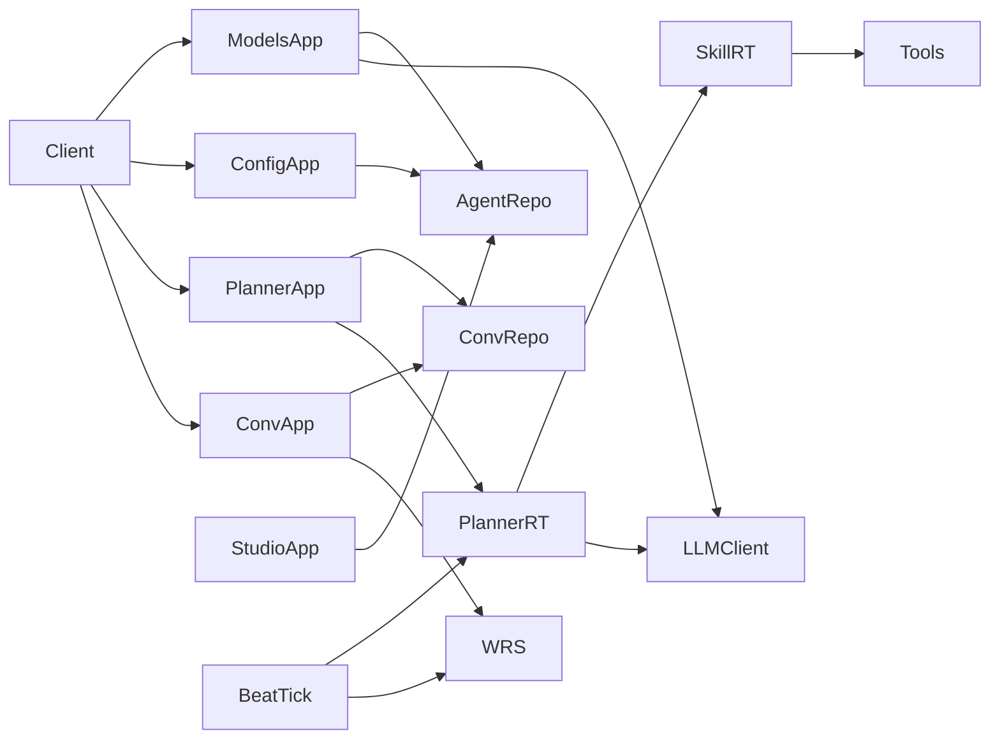

# 2026-08-20 自主规划智能体与模型管理 - 应用层/服务层 - 修改

## 用户需求理解

用户要求开启一组**自主规划智能体**相关应用建设，覆盖：

1. **deepagents 主循环**：规划型 Agent（自选工具/技能、多步推理），不是 Studio 静态编排图。
2. **多租户配置**：Profile 等配置按组织隔离（现网 `agent_profile.owner_organization_id` 已有列）。
3. **技能 / 工具 / MCP 配置管理**：对已有 `agent_skill` / `agent_tool` / `agent_mcp_server` 提供写接口与目录。
4. **定时任务**：对已有 `agent_beat_task` + Celery Beat `dispatch_beat_tasks` 提供管理，并让到期任务能触发规划循环（或继续触发 Flow）。
5. **模型管理**：考虑抽成**公共应用**，同时服务 Workflow Studio 与规划主循环。
6. **会话历史**：规划智能体与 Studio 会话**共用会话数据管理**（现网 `conversation` 应用 + `conv_*` 仓储），不另建一套历史表。

### 现状（与本轮相关）

| 能力 | 现状 |
| --- | --- |
| 应用层 | 已有 `auth` / `conversation` / `studio`。Studio 对 Profile/LLM/Tool **只读**。发消息 **强制 `flow_id`**。会话列表不按 `app_key` 过滤。 |
| 规划循环 | `SkillRuntime` 未落地；`FlowRuntime` 只编译静态图；`tool` 节点按图绑定工具，Agent 不能自选技能包。 |
| 模型 | `agent_llm` 表 + 仓储；运行时 `ChatCompletionClient` 主要读 **环境变量** `llm_*`，未按会话解析 `agent_llm`。 |
| Beat | 表强制 `flow_id`；tick 只 `start_run` 工作流。无 HTTP 管理面。 |
| 工具/MCP | `ToolExecutor` 已分发 builtin/http/mcp；MCP 生产 SDK 仍为预留。仓储无 `agent_skill` 专用方法。 |
| 多租户 | 仅 Profile 有 `owner_organization_id`；LLM/Skill/Tool/MCP/Beat **无组织列**，`code` 全局唯一。Studio **不按组织过滤**。 |
| 鉴权 | 与 Studio 相同阶段：JWT 必须有；**尚未**把业务权限接到 `PermissionService`。 |
| 施工状态 | `应用层 / api`、`服务层 / runtime`、`服务层 / tools`、`服务层 / celery_app`、映射层 Agent/Conversation 均为 **空闲**。 |

### 澄清过程

2026-08-20 用户答复（原文要点，不回溯改写此前草案条款）：

1. **Q1 路径**：自主规划会话用 `/api/v1/conversations/planner*`；工作流直连会话用 `/api/v1/conversations/workflow*`。不是独立的 `/api/v1/planner/messages`。
2. **Q2**：用户要求先比较「自研循环 vs 引入 langchain-deepagents」再选型。比较见下文「Q2 技术说明」。追加确认：**采用自研自主规划循环**，不引入 `langchain-deepagents` 包。以后轮次方案放入 `docs/plan/unreached/`。
3. **Q3**：Profile **不是**按 `owner_organization_id` 做组织隔离。Profile 与 RBAC 的组织 / 部门 / 角色 / 个人存在**绑定**；仅 RBAC 管理员或系统总管理员可创建并绑定；可见性按绑定隔离；管理员看见其权限范围内全部 Profile。
4. **Q4**：同意 LLM 全局共享、HTTP 打码密钥、Studio `GET /llms` 只读兼容、写接口在 `models`。
5. **Q5**：Beat **本期只绑定工作流定时**；自主规划智能体的定时任务**暂缓**，写入方案，以后再做。
6. **Q6**：`profile_id` 可放会话 `metadata`；列表简要信息不必带；进详情再加载。
7. **Q7**：前端、RBAC 审核、限流、真实 MCP 生产接通、Temporal **本阶段不接入**；须**留好** RBAC 管理 Profile / Skill / MCP 的路径，以后再接 `PermissionService`。
8. **Q8**：先做 **配置 + 模型** 应用；本大型工程按**多轮施工**拆分，每轮单独 plan、单独锁定施工状态。

### 多轮施工拆分（总纲，本文件不作为单轮开工令）

| 轮次 | 主题 | 计划文档 | 状态 |
| --- | --- | --- | --- |
| 第 1 轮 | 公共模型应用 + Agent 配置应用（Profile/Skill/Tool/MCP）+ 工作流 Beat CRUD + RBAC 绑定数据路径（不审核） | `2026-08-20-配置与模型管理应用-应用层-修改.md` | 已完成 |
| 第 2 轮 | 会话路径拆分 `conversations/workflow*` 与 `conversations/planner*` | `unreached/2026-08-20-会话路径拆分planner与workflow-应用层-修改.md` | unreached |
| 第 3 轮 | 自研自主规划循环 + SkillRuntime | `unreached/2026-08-20-自研自主规划循环-服务层应用层-修改.md` | unreached |
| 以后 | 规划侧 Beat | `unreached/2026-08-20-规划智能体定时任务Beat-服务层应用层-修改.md` | unreached |
| 以后 | RBAC 绑定可见性与管理员创建 | `unreached/2026-08-20-RBAC绑定可见性与管理员创建-服务层应用层-修改.md` | unreached |
| 以后 | 表示层前端 | `unreached/2026-08-20-自主规划与模型管理前端-表示层-修改.md` | unreached |

## 需求中的待澄清事项

无待澄清事项。Q2 已确认为自研循环；未开工内容的施工方案在 `docs/plan/unreached/`。

### Q2 技术说明：自研循环是否更灵活？引入 langchain-deepagents 的代价？

LangChain 自己把栈分成三层：**LangGraph = 运行时**（图、checkpoint、中断），**LangChain `create_agent` = 薄循环**，**Deep Agents = 厚 Harness**（在 `create_agent` 上默认叠规划工具、虚拟文件系统、子 Agent、上下文压缩、backend）。`create_deep_agent()` **不提供新运行时**，只是一套强意见的中间件与默认工具。因此「自研 vs deepagents」不是「要不要用 LangGraph」，而是「规划循环的控制面归我们还是归 Harness」。

#### 自研是否比原始 deepagents 更灵活？

**在本工程控制面上：是。** 我们可以把循环编成与现网一致的三槽 state、`ToolExecutor`（builtin/http/mcp）、`ff.stream` SSE、Celery envelope、Postgres checkpointer、护栏落在持久化 state 而非 token、以及后续按 `agent_resource_binding` 裁剪可见技能。Harness 的默认 todos / 虚拟文件 / 子 Agent / 自动摘要，若与 `agent_skill` 行式技能、对象存储原文、既有观测模型不一致，改起来要绕开它的 middleware 顺序，灵活性反而差。

**在长程 Agent 能力面上：否。** 规划清单、上下文压缩、子 Agent、可插拔 filesystem/sandbox backend，deepagents 已经打过样。自研若要做到同等能力，是后续多轮功能，不是第一天就更强。

结论：自研赢在 **与 FlowFactory 已落地栈对齐、可裁剪**；deepagents 赢在 **开箱的长程 Harness**。二者不是「谁绝对更灵活」，而是灵活点不同。

#### 直接引入 langchain-deepagents 的问题

1. **双工具模型**：Harness 要 LangChain `@tool`；现网是表驱动 `agent_tool` + `ToolExecutor`。要做一层适配，MCP/HTTP 配置与 schema 校验会分叉。
2. **双技能模型**：Deep Agents 的 Skill 偏文件/markdown + backend；现网是 `agent_skill`（prompt + `tool_ids`）。要么弃表，要么再适配一层。
3. **双状态与调度**：Harness 自带 checkpointer/thread 习惯用法；现网已有 RunSnapshot、Celery prefork、`waiting_child`、HITL pending。容易出现两套可恢复状态。
4. **双流式协议**：`astream_events` 与自建 `SseEvent` / RabbitMQ `ff.stream` 字段不对齐，token 护栏策略也会被其中间件打乱。
5. **意见过重**：虚拟 FS、todos、子 Agent 会进入生产默认路径；关掉它们等于买一套再拆一套。
6. **版本与依赖**：该库迭代快（含 alpha 线），会牵动 LangChain/LangGraph 版本，和现网 runtime 编译、观测包装耦合。
7. **授权裁剪困难**：按绑定给不同租户不同工具集，要插进 Harness 的 tool 装配点，不如自研 compile 时过滤干净。

第 3 轮已锁定为 **自研 LangGraph 循环**（见 `unreached/` 对应方案）。不把 `deepagents` 包当作运行时依赖；todos / 摘要 / 子 Agent 按需列入后续能力，不在第 3 轮必做。

## 施工方案

本文件为**总纲**。第 1 轮执行方案见 `2026-08-20-配置与模型管理应用-应用层-修改.md`。

以下「草案」保留为澄清前文本，**不得作为开工范围**。

## 澄清前草案存档（已不作执行依据）

> 以下按 **Q1–Q8 全部取默认** 编写，便于你直接说「按默认实现」。任一默认被否决则改对应小节后再锁定。

### 1. 应用与依赖

- `models`：LLM CRUD；解析 `agent_llm` 为 `ChatCompletionClient`（供 compile / 规划循环，不把密钥返回浏览器）。
- `agent_config`：Profile / Skill / Tool / MCP / Beat 的 REST。
- `planner`：`POST /api/v1/planner/messages`（或等价）→ 写会话 + 入队规划 Run。
- `conversation`：列表过滤、发消息分支（flow vs profile）；SSE 不变。
- `studio`：`GET /llms` 保留；不在本轮改 Flow 编排语义。

### 2. 服务层：规划主循环（Q2-A）

新增（建议包位置 `service/runtime/planner.py` + `service/tools/skill.py`）：

- **`SkillRuntime`**：按 `agent_skill` 组装 `prompt_template` + 解析 `tool_ids`，调用已有 `ToolExecutor`。
- **`PlannerRuntime.compile(profile)`**：固定 StateGraph（非用户画布）：
  - 系统提示 = Profile.`system_prompt` + 已选 Skill 说明；
  - 工具集 = Profile.`skill_ids` 展开后的工具（去重）；
  - 循环：模型 function-call / tool_calls → 执行 → 写回 messages，直到无工具调用或达到 `planner_max_steps`（配置项）；
  - 流式：复用 LLM `stream` + `StreamEventBus`（`speaking` / `tool_calling` / `step_running`）。
- **入队**：与 Flow 相同，走 Celery `run_langgraph_flow`（envelope 增加 `kind=planner` + `profile_id`），避免第二套 worker。若 envelope 扩展成本高，则新增 `TASK_PLANNER` 仍由同一 worker 进程执行。
- 默认模型：Profile.`default_llm_id` → `models` 解析；缺省回退环境变量 `llm_*`（与现网兼容）。

**不改** Studio 图编译器的节点类型集合（不把「规划循环」做成一种 Flow `NodeType`）。规划与编排是两条运行时。

### 3. 多租户（Q3-A）

- Profile：创建时写入当前用户 `organization_id`；列表/更新/删除仅 `owner_organization_id in (user.org, NULL)` 可见，跨组织 404（避免探查）。
- 全局 Profile（`owner_organization_id IS NULL`）本轮 **只读**（防止租户改共享模板）；是否允许平台管理员写：本轮不做 RBAC，故 **不允许 HTTP 改 NULL 组织行**。
- Skill/Tool/MCP/LLM：全局 CRUD（JWT 即可），与现表一致。

### 4. 模型应用 `models`（Q4）

| 方法 | 路径 | 说明 |
| --- | --- | --- |
| GET | `/api/v1/models/llms` | 活跃目录；无 `config` 密钥 |
| POST | `/api/v1/models/llms` | 创建；`config` 可含 `base_url` / `api_key` / `temperature` |
| GET | `/api/v1/models/llms/{id}` | 详情；`config` 对 `api_key` 打码 |
| PATCH | `/api/v1/models/llms/{id}` | 更新；空密钥表示不改 |
| POST | `/api/v1/models/llms/{id}/deactivate` | `is_active=false` |

校验 `provider` 枚举（至少 `openai` / `azure` / `local`）。`code` 冲突 409。

运行时增加 `resolve_llm_client(llm_id | code) -> ChatCompletionClient`，Studio 图 `llm` 节点与规划循环共用（图节点仍按 `llm_ref` code 解析，与 v1 定义一致）。

### 5. 配置应用 `agent_config`

CRUD（JWT；非法引用 400；code 冲突 409）：

- Profile：`system_prompt` / `default_llm_id` / `skill_ids`；校验 LLM、Skill 存在。
- Skill：`tool_ids` / `prompt_template`；校验 Tool 存在。仓储补 `AgentSkill`。
- Tool：`kind` / `schema` / `config` / `mcp_server_id`；`kind=mcp` 必须带 server。
- MCP Server：`transport` / `config` / `is_active`。本轮不强制探测连通。
- Beat：见第 6 节。

列表均支持 `offset`/`limit`。

### 6. Beat（Q5-A）

- Alembic：`agent_beat_task.flow_id` nullable；加 `profile_id` FK → `agent_profile`（nullable）；Check：`(flow_id IS NULL) <> (profile_id IS NULL)`（恰一非空）。
- HTTP：创建/列表/启停/改 cron 与 `input_payload`。
- `dispatch_due_tasks`：有 `flow_id` 保持现逻辑；有 `profile_id` 则入队规划 Run（系统用户仍为 `beat_system_user_id`）。锁与 croniter 不变。

### 7. 会话共用（Q6-A）

- `GET /conversations?app_key=` 可选过滤。
- `POST /conversations` 允许传入 `app_key`（修正现网写死 `conversation`）。
- `POST /conversations/messages`：`flow_id` 与 `profile_id` 至少其一（或会话上已有对应字段/metadata）；`app_key=planner` 走规划入队，否则走 `WorkflowRuntimeService.start`。
- `planner` 应用可只提供转发/便捷入口，避免两套消息语义。
- SSE：`/conversations/{id}/events` 不变。

### 8. 文档与测试

- 更新 `api_reference_server.md`、`service_layer.md`（SkillRuntime / 规划循环 / models 解析）。
- 映射层若改 Beat：同步 `data_schema_server.md`（**不改**历史 plan 文档）。
- 单测：401；Profile 组织隔离；models 密钥不回传；Skill 绑工具；发消息 `profile_id` 入队（Fake runtime）；Beat 恰一约束；规划循环在 Fake LLM/工具下结束；Studio 回归只读 `/llms`；ruff 无 error。

### 9. 施工状态（仅在用户确认锁定后）

标记施工中：

- `应用层 / api`
- `服务层 / service/runtime`
- `服务层 / service/tools`
- `服务层 / service/celery_app`（若改 Beat dispatch）
- `映射层 / data_schema（Agent）`（若改 Beat 表）

完成后改回空闲并写施工简报。不改历史 `docs/plan/*`。

## 方案待澄清事项

无待澄清事项。总纲本身不作为第 1 轮以外的开工令；以后轮次从 `unreached/` 移入 `docs/plan/` 并确认后再施工。

## 验收标准

总纲无单轮验收。第 1 轮验收写在对应 plan 中。
